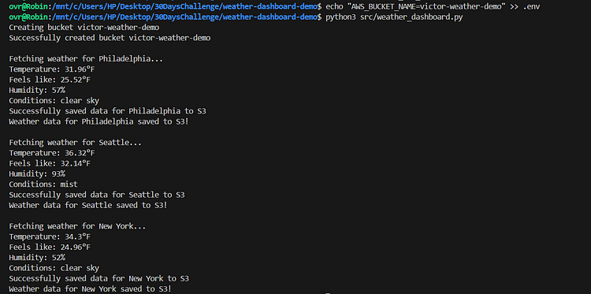
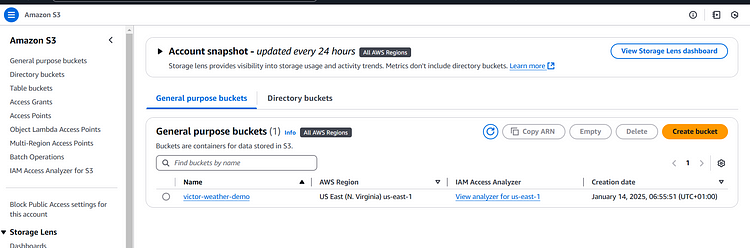
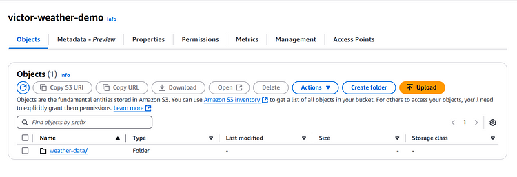
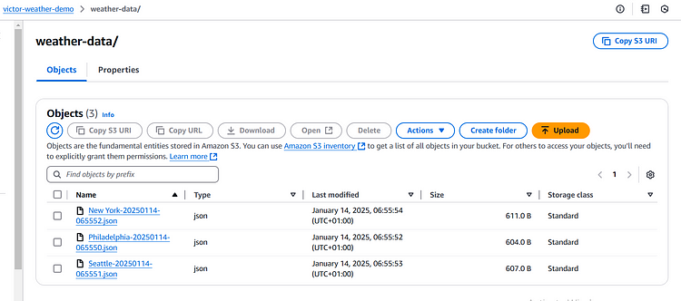

# 30 Days DevOps Challenge - Weather Dashboard
Day 1: Building a weather data collection system using AWS S3 and OpenWeather API
# Weather Data Collection System - DevOps Day 1 Challenge
## Project Overview
This project is a Weather Data Collection System that demonstrates core DevOps principles by combining:
- External API Integration (OpenWeather API)
- Cloud Storage (AWS S3)
- Infrastructure as Code
- Version Control (Git)
- Python Development
- Error Handling
- Environment Management

## Prerequisites

Before you begin, ensure that you have the following:
- An account with [OpenWeather](https://openweathermap.org/api) and your API key.
- An [AWS account ](aws.amazon.com) with access key and secret key for configuring your AWS CLI.
- [AWS CLI](https://docs.aws.amazon.com/cli/latest/userguide/getting-started-install.html) installed on your machine.
- [Python](https://www.python.org/downloads/) 3.x installed on your system.


## Features
- Fetches real-time weather data for multiple cities
- Displays temperature (°F), humidity, and weather conditions
- Automatically stores weather data in AWS S3
- Supports multiple cities tracking
- Timestamps all data for historical tracking
## Technical Architecture
- **Language:** Python 3.x
- **Cloud Provider:** AWS (S3)
- **External API:** OpenWeather API
- **Dependencies:** 
  boto3 (AWS SDK)
  python-dotenv
  requests

## Project Structure

```
weather-dashboard/
  ├── src/
  │   ├── \_\_init__.py
  │   └── weather_dashboard.py
  ├── tests/
  ├── data/
  ├── .env
  ├── .gitignore
  ├── requirements.txt

  ```

## Setup Instructions

1. Clone the repository:
 `git clone https://github.com/Vivixell/weather-dashboard-demo.git`

_**Note: You will need to manually delete the Images folder, as it contains my final results and is not part of the project structure.**_

2. Install dependencies:
`pip install -r requirements.txt`


3. Configure environment variables (.env):

```
OPENWEATHER_API_KEY=your_api_key
AWS_BUCKET_NAME=your_bucket_name
```

4. Configure AWS credentials:
`aws configure`

5. Run the application:
`python src/weather_dashboard.py`

Below is a screenshot of the Python script running from my terminal:


Next, I verified the bucket creation using the AWS Console:


Lastly, here are the images verifying our weather JSON data stored in the bucket:




**What I Learned**
- AWS S3 bucket creation and management
- Environment variable management for secure API keys
- Python best practices for API integration
- Git workflow for project development
- Error handling in distributed systems
- Cloud resource management

**Future Enhancements**
* Add weather forecasting
* Implement data visualization
* Add more cities
* Create automated testing
* Set up CI/CD pipeline